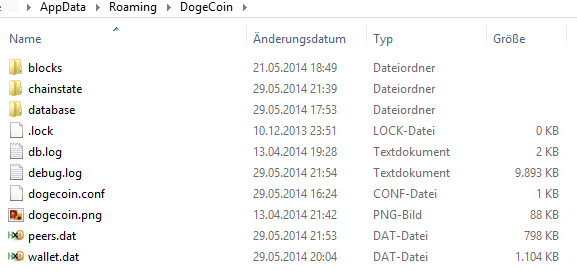
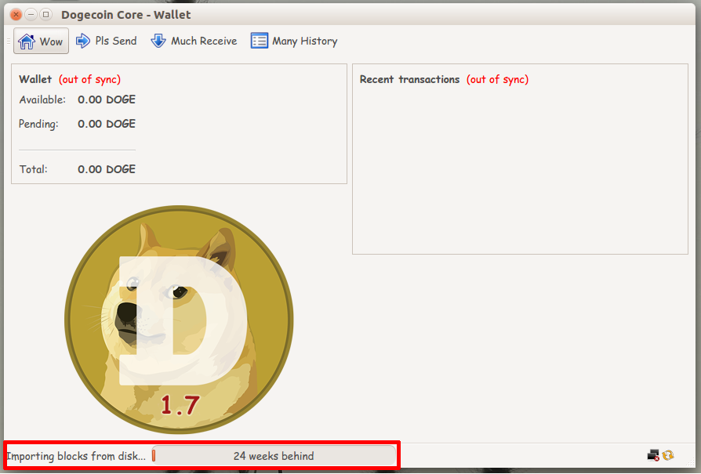

### Bootstrap the Blockchain Synchronization

Normally the Dogecoin Core client will download the transaction and network information, called the blockchain, from network by syncing with the other clients. This can be a process that can take multiple days as the Dogecoin block chain has grown to approximately 5 gigabytes, and is growing almost half a gigabyte every month. Luckily there is a safe and fast way to speed up this process. We’ll show you how to bootstrap your blockchain to bring your client up to speed in just a few simple steps.

You only need to do this when first syncing Dogecoin Core; after that, updates are relatively small and shouldn't take too long.

### Requirements

- A fresh install of the Dogecoin Core client software.

### Download the block chain
Be sure to only use the official repositories listed below.
Both mirrors are updated nightly and hosted by [SoChain](https://chain.so)

#### US Mirror

Click [here](https://bootstrap.chain.so/) to go to the download page, or use the URL below.

    https://bootstrap.chain.so/bootstrap.dat

#### EU Mirror

Click [here](https://uk.bootstrap.chain.so/) to go to the download page, or use the URL below.

    https://uk.bootstrap.chain.so/bootstrap.dat

### Importing the blockchain
Launch the Dogecoin Core client once before continuing the process and then exit the Dogecoin Core software. Be sure not to have an actively used wallet in use. Now we are going to copy the download of the blockchain to the Dogecoin Core data directory. You should run the client software at least once so it can generate the data directory. Copy the downloaded bootstrap.dat file into the Dogecoin data folder.

**For Windows users:**
Open explorer, and type into the address bar:

    %APPDATA%\Roaming\DogeCoin

This will open up the data folder. It should look like the image below. Copy over the bootstrap.dat from your download folder to this directory.

**For OSX users:**
Open Finder by pressing Press [shift] + [cmd] + [g] and enter:

    ~/Library/Application Support/DogeCoin/

**For Linux users:**
The directory is hidden in your User folder. Go to:

    ~/.dogecoin/

### Importing the blockchain
Now start the Dogecoin Core client software. It should show "Importing blocks from disk" like the image below. 

Wait until the import finishes. The client will download the last days not covered by the import. Congratulations you have successfully imported the blockchain!

### Is this safe?

Yes, the above method is safe. The download contains only raw block chain data and the client verifies this on import. Do not download the blockchain from unofficial sources, especially if they provide `*.rev` and `*.sst` files. These files are not verified and can contain malicious edits.
