# Getting access to Linux at AWS

In order to build a node from source, run it and connect it to the Cardano mainnet, you need a Linux system with at least 4GB RAM and 24GB harddrive space.
The RAM is mostly needed for _building_ the node; for _running_ it, 1GB would be sufficient. The harddrive space is necessary if you want to connect to and download
the Cardano blockchain on mainnet. If you just want to set up a local testnet or connect to an external testnet, less space is needed.

If you do not have access to a computer running Linux, you can use Amazon Web Services (AWS) to create a cloud-based virtual machine running Linux for free.
To do so, please follow the steps below:

1. Go to [Amazon Web Services (AWS)](https://aws.amazon.com/) and create a (free) account if you do not have one already.

2. Go to the _AWS Management Console_.

3. Go to the _EC2 Dashboard_.

   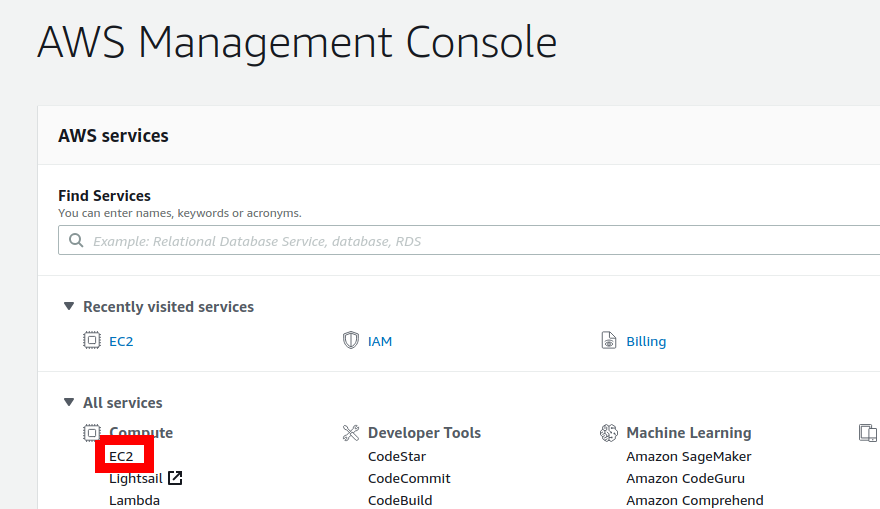

4. If you already have a running instance, go to step 9.

5. We first make sure to get enough harddrive space (at least 24GB). Click on _Volumes_.

   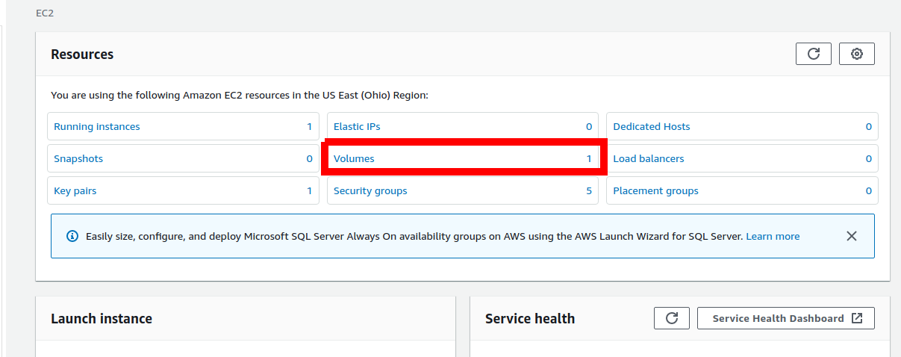

6. Under _Actions_, select _Modify Volume_.

   

7. In the _Modify Volume_ diaglog, select a size of 24 and click _Modify_, then confirm in the next dialog.

   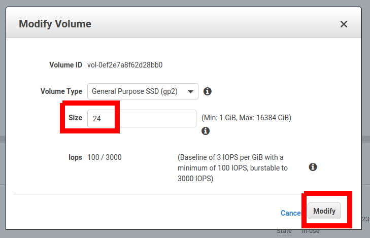

8. Go back to the _EC2 Dashboard_.

   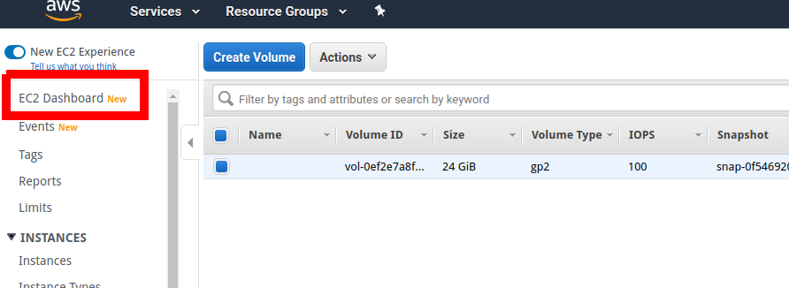 

9. Go to _Launch Instance_.

  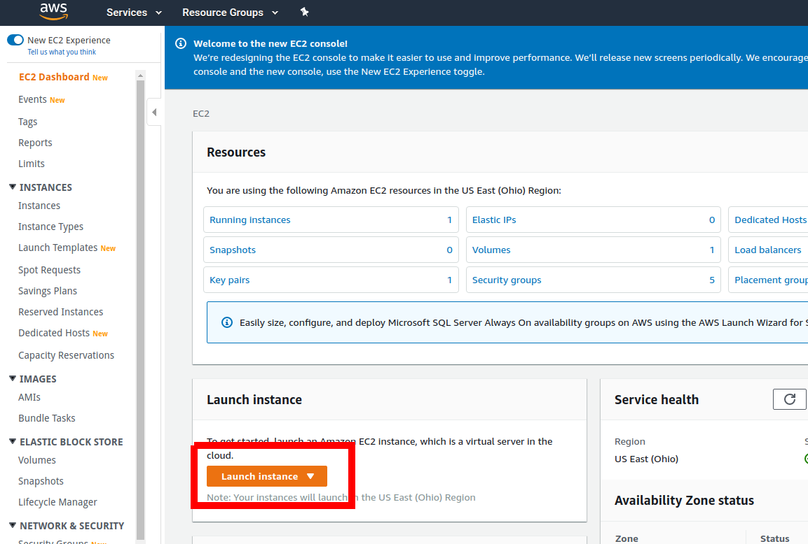

10. As Amazon Machine Image, choose _Amazon Linux 2 (HVM), SSD Volume Type_, 64-bit (x86).

  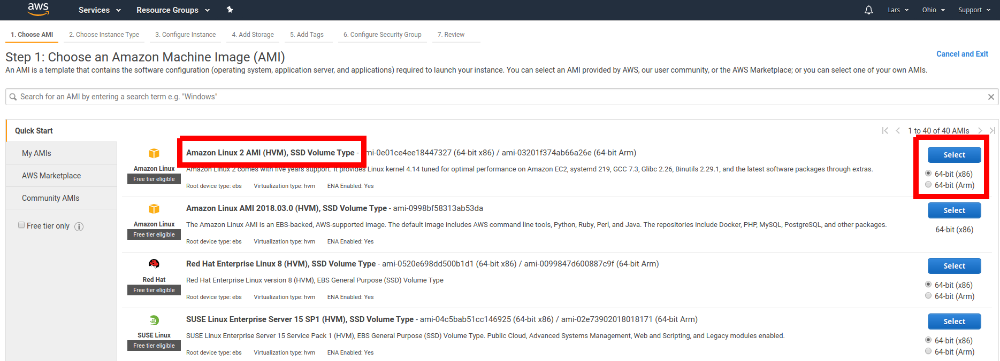

11. As Instance Type, choose _t2.medium_, then click _Review and Launch_ and finally _Launch_ on the next screen.

  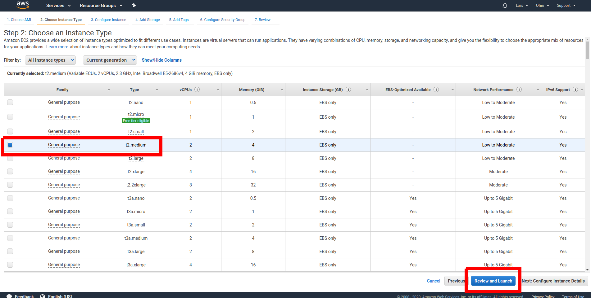

12. Create a key pair (or use an existing one).

  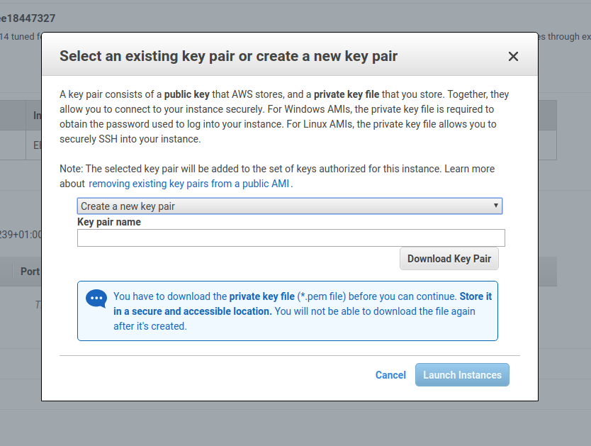

13. _Connect_ to your instance.

  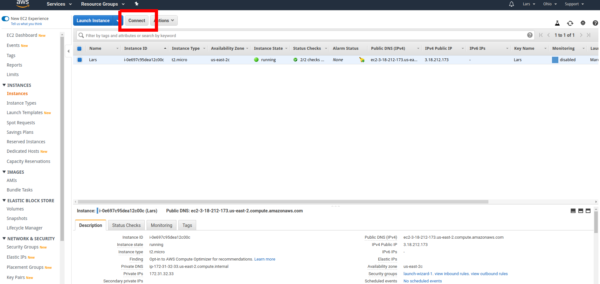

14. You can use the _EC2 Instance Connect_ connection method.

  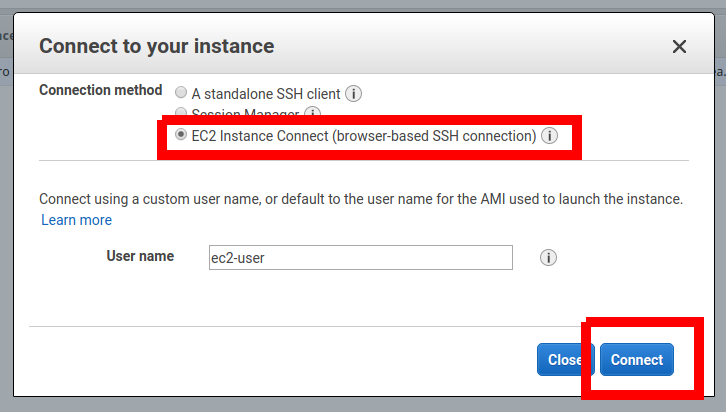

15. Type ``echo hello`` (and Enter) to try whether the connection works. This should print "hello" to the console.

  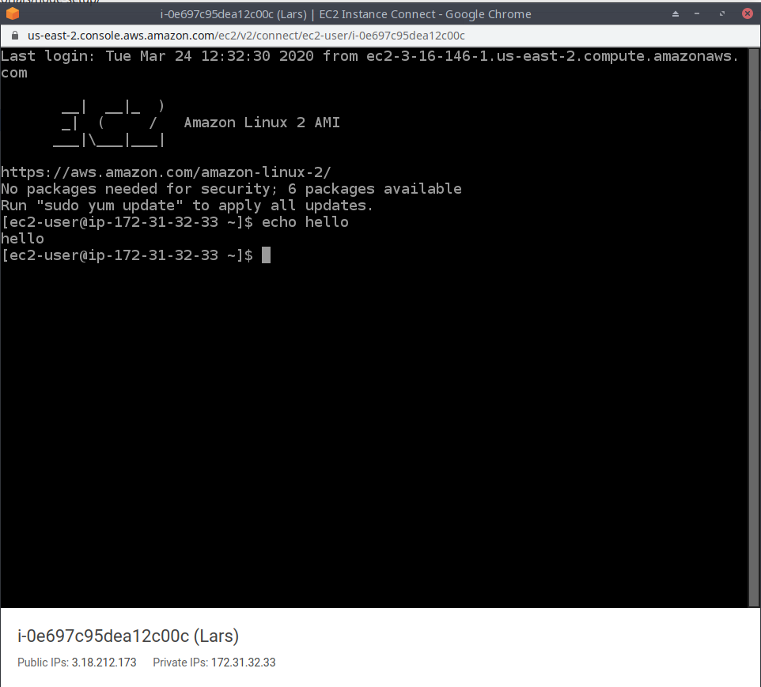

Congratulations! You have now access to a machine running Linux.
