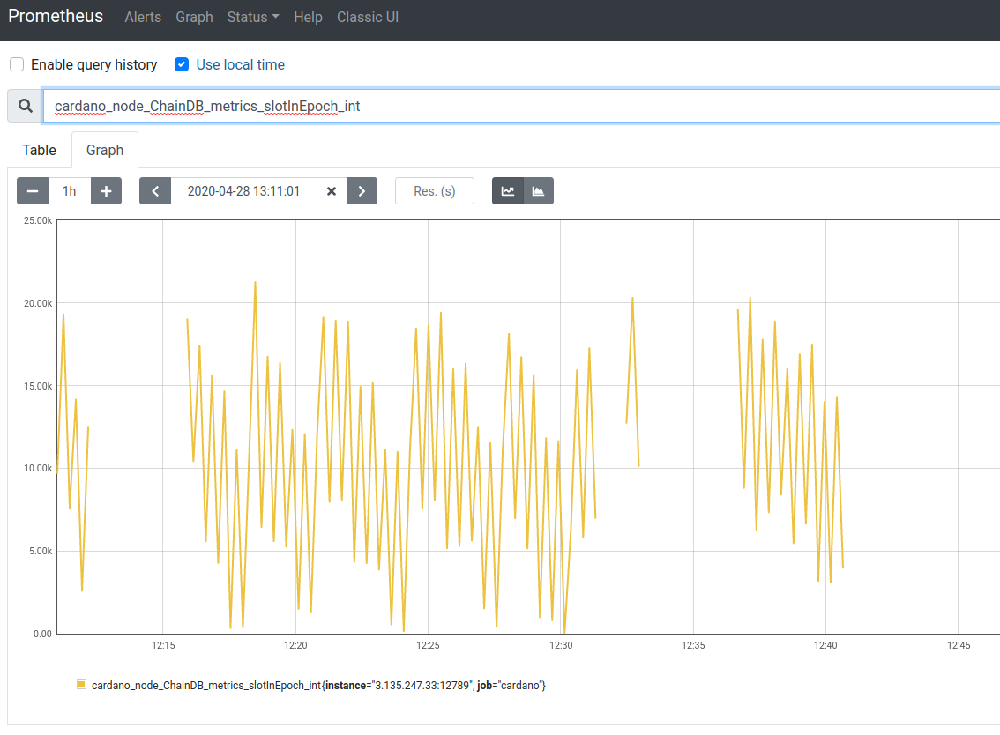

# Monitoring a Node with Prometheus

Open the port 12798, as it is the default port for prometheus, as from the `config.json` file.
When you start the node, it makes Prometheus metrics available at port 12798 (or whatever port you specified in `config.json`). You can then setup a monitoring server or monitor your node from your local machine.

#### Add Node Exporter to your server
You can get the best out of prometheus if you have both Prometheus on your local machine or monitoring server and Prometheus Node Exporter on your node's server. How to do this depends on your platform and setup, but you can find documentation:

   * [Prometheus](https://prometheus.io/docs/prometheus/latest/getting_started/).

   * [Node exporter](https://prometheus.io/docs/guides/node-exporter/)

#### Setup Prometheus in your local machine or monitoring server
Prometheus needs to be configured to monitor your Cardano Node. A minimalistic configuration file doing this could look like this:

        global:
          scrape_interval:     15s
          external_labels:
            monitor: 'codelab-monitor'

        scrape_configs:
          - job_name: 'cardano' # To scrape data from the cardano node
            scrape_interval: 5s
            static_configs:
              - targets: ['a.b.c.d:12798']
          - job_name: 'node' # To scrape data from a node exporter to monitor your linux host metrics.
            scrape_interval: 5s
            static_configs:
              - targets: ['a.b.c.d:9100']

You have to replace `a.b.c.d` with the public IP-address of your Cardano Node server, which you can find on the dashboard under _IPv4 Public IP_.

#### Start prometheus

    ./prometheus --config.file=prometheus.yml

#### Start Prometheus node exporter on your node's server, for example:

    ./node_exporter

On your browser open `a.b.c.d:9090`, pick one or more interesting metrics to graph and enjoy!

   

**NOTE: Security configurations you should perform on your monitoring server are out of scope for this tutorial.
