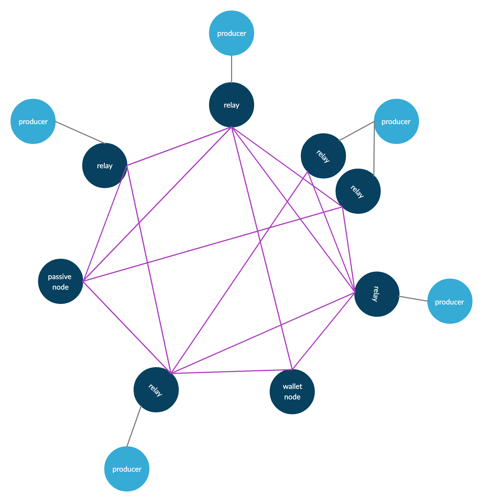

# Generate your stake pool keys

A stake pool needs at least 2 running nodes: A __block-producing__ node and a __relay__ node.

We need to setup our __block-producing__ node. You can build the node from source or maintain a single build on your local machine and only upload the binaries to your __block-producing__ and __relay__ servers. Just make sure you have consistent versions across them.

The __block-producing__ node will only connect with it's __relay__, while the __relay__ will establish connections with other relays in the network.  Each node must run in an independent server.

#### Basic block-producing node firewall configuration:

* Make sure you can only login with SSH Keys, not password.
* Make sure to setup SSH connections in a port different than the default 22
* Make sure to configure the firewall to only allow connections from your relay nodes by setting up their ip addresses.

#### Basic relay node firewall configuration:

 * Make sure you can only login with SSH Keys, not password.
 * Make sure to setup SSH connections in a port different than the default 22.
 * Make sure you only have the strictly necessary ports opened.

#### Creating keys for our block-producing node

**WARNING:**
You may want to use your __local machine__ for this process (assuming you have cardano-node and cardano-cli on it). Make sure you are not online until you have put your __cold keys__ in a secure storage and deleted the files from you local machine.

The __block-producing node__ or __pool node__ needs:

* __Cold__ key pair,
* __VRF__ Key pair,
* __KES__ Key pair,
* __Operational Certificate__

Create a directory on your local machine to store your keys:

    mkdir pool-keys
    cd pool-keys

#### Generate __Cold__ Keys and a __Cold_counter__:

    cardano-cli node key-gen \
    --cold-verification-key-file cold.vkey \
    --cold-signing-key-file cold.skey \
    --operational-certificate-issue-counter-file cold.counter

#### Generate VRF Key pair

    cardano-cli node key-gen-VRF \
    --verification-key-file vrf.vkey \
    --signing-key-file vrf.skey

#### Generate the KES Key pair

    cardano-cli node key-gen-KES \
    --verification-key-file kes.vkey \
    --signing-key-file kes.skey

#### Generate the Operational Certificate

We need to know the slots per KES period, we get it from the genesis file:

    cat mainnet-shelley-genesis.json | grep KESPeriod
    > "slotsPerKESPeriod": 3600,

Then we need the current tip of the blockchain:

    cardano-cli query tip --mainnet
    {
        "epoch": 259,
        "hash": "dbf5104ab91a7a0b405353ad31760b52b2703098ec17185bdd7ff1800bb61aca",
        "slot": 26633911,
        "block": 5580350
    }

Look for tip `slot` value. In this example we are on slot `26633911`. So we have KES period is `7398`:

    expr 26633911 / 3600
    > 7398

To generate the certificate:

    cardano-cli node issue-op-cert \
    --kes-verification-key-file kes.vkey \
    --cold-signing-key-file cold.skey \
    --operational-certificate-issue-counter cold.counter \
    --kes-period 7398 \
    --out-file node.cert

#### Move the cold keys to secure storage and remove them from your local machine.

The best place for your cold keys is a __SECURE USB__ or other __SECURE EXTERNAL DEVICE__, not a computer with internet access.

#### Copy the files to the server:

Copy your VRF keys, KES Keys, and Operational Certificate to your __block-producing__ server. For example:

    scp -rv -P<SSH PORT> -i ~/.ssh/<SSH_PRIVATE_KEY> ~/pool-keys USER@<PUBLIC_IP>:~/

    > Transferred: sent 3220, received 6012 bytes, in 1.2 seconds
    Bytes per second: sent 2606.6, received 4866.8
    debug1: Exit status 0

Log in to your server and verify that the files are there:

    ls pool-keys

    > kes.skey  kes.vkey  node.cert  vrf.skey  vrf.vkey

Later on we will learn how to register our pool in the blockchain.
